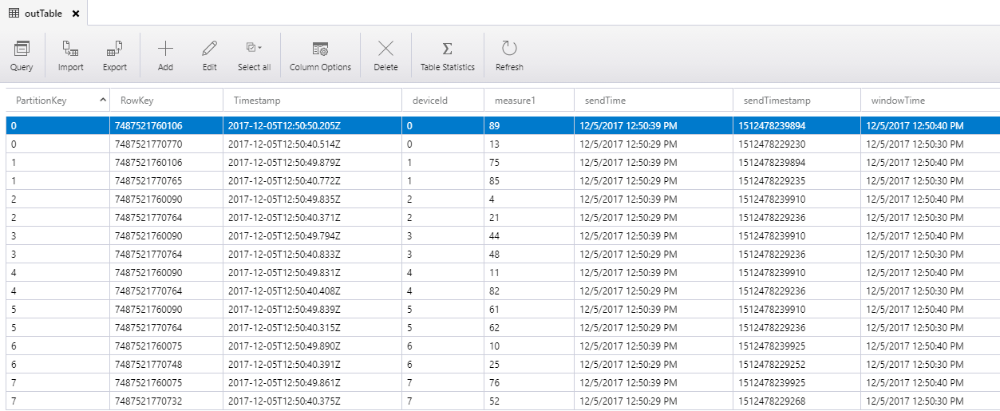

# Hackfest 171206

## Code's explanations

The goal is to get only last event per device and per time Window.

Here is the pipeline: 
- events are sent to event hub `eh171124a` by program in `EHSolution/EventHubSample`. For example, events are sent every 750 ms for all the devices (8 devices).
- events are filtered by choosen time window (for example: every 10 seconds) so that only the last one per device is sent back to event hub `eh171124b`
- events in event hub `eh171124b` are consumed by Azure function `EventHubAfterAsa` and sent to table storage, in table `outTable`

Sample input

```json
{"deviceId":0,"measure1":7,"sendTime":"2017-12-05 12:50:23.506","sendTimestamp":1512478223507}
{"deviceId":1,"measure1":41,"sendTime":"2017-12-05 12:50:24.149","sendTimestamp":1512478224150}
{"deviceId":2,"measure1":52,"sendTime":"2017-12-05 12:50:24.149","sendTimestamp":1512478224150}
{"deviceId":3,"measure1":8,"sendTime":"2017-12-05 12:50:24.149","sendTimestamp":1512478224150}
{"deviceId":4,"measure1":93,"sendTime":"2017-12-05 12:50:24.165","sendTimestamp":1512478224165}
{"deviceId":5,"measure1":98,"sendTime":"2017-12-05 12:50:24.165","sendTimestamp":1512478224165}
{"deviceId":6,"measure1":8,"sendTime":"2017-12-05 12:50:24.165","sendTimestamp":1512478224165}
{"deviceId":7,"measure1":73,"sendTime":"2017-12-05 12:50:24.165","sendTimestamp":1512478224165}
{"deviceId":0,"measure1":65,"sendTime":"2017-12-05 12:50:26.581","sendTimestamp":1512478226582}
{"deviceId":1,"measure1":89,"sendTime":"2017-12-05 12:50:26.581","sendTimestamp":1512478226582}
{"deviceId":2,"measure1":36,"sendTime":"2017-12-05 12:50:26.581","sendTimestamp":1512478226582}
{"deviceId":3,"measure1":43,"sendTime":"2017-12-05 12:50:26.581","sendTimestamp":1512478226582}
{"deviceId":4,"measure1":16,"sendTime":"2017-12-05 12:50:26.581","sendTimestamp":1512478226582}
{"deviceId":5,"measure1":57,"sendTime":"2017-12-05 12:50:26.581","sendTimestamp":1512478226582}
{"deviceId":6,"measure1":46,"sendTime":"2017-12-05 12:50:26.581","sendTimestamp":1512478226582}
{"deviceId":7,"measure1":34,"sendTime":"2017-12-05 12:50:26.581","sendTimestamp":1512478226582}
{"deviceId":0,"measure1":77,"sendTime":"2017-12-05 12:50:27.450","sendTimestamp":1512478227451}
{"deviceId":1,"measure1":1,"sendTime":"2017-12-05 12:50:27.456","sendTimestamp":1512478227456}
{"deviceId":2,"measure1":78,"sendTime":"2017-12-05 12:50:27.460","sendTimestamp":1512478227461}
{"deviceId":3,"measure1":5,"sendTime":"2017-12-05 12:50:27.460","sendTimestamp":1512478227461}
{"deviceId":4,"measure1":55,"sendTime":"2017-12-05 12:50:27.460","sendTimestamp":1512478227461}
{"deviceId":5,"measure1":90,"sendTime":"2017-12-05 12:50:27.460","sendTimestamp":1512478227461}
{"deviceId":6,"measure1":86,"sendTime":"2017-12-05 12:50:27.476","sendTimestamp":1512478227477}
{"deviceId":7,"measure1":95,"sendTime":"2017-12-05 12:50:27.476","sendTimestamp":1512478227477}
{"deviceId":0,"measure1":14,"sendTime":"2017-12-05 12:50:28.329","sendTimestamp":1512478228330}
{"deviceId":1,"measure1":73,"sendTime":"2017-12-05 12:50:28.333","sendTimestamp":1512478228334}
{"deviceId":2,"measure1":82,"sendTime":"2017-12-05 12:50:28.335","sendTimestamp":1512478228335}
{"deviceId":3,"measure1":65,"sendTime":"2017-12-05 12:50:28.335","sendTimestamp":1512478228335}
{"deviceId":4,"measure1":66,"sendTime":"2017-12-05 12:50:28.335","sendTimestamp":1512478228335}
{"deviceId":5,"measure1":16,"sendTime":"2017-12-05 12:50:28.335","sendTimestamp":1512478228335}
{"deviceId":6,"measure1":69,"sendTime":"2017-12-05 12:50:28.351","sendTimestamp":1512478228351}
{"deviceId":7,"measure1":91,"sendTime":"2017-12-05 12:50:28.351","sendTimestamp":1512478228351}
{"deviceId":0,"measure1":13,"sendTime":"2017-12-05 12:50:29.229","sendTimestamp":1512478229230}
{"deviceId":1,"measure1":85,"sendTime":"2017-12-05 12:50:29.234","sendTimestamp":1512478229235}
{"deviceId":2,"measure1":21,"sendTime":"2017-12-05 12:50:29.236","sendTimestamp":1512478229236}
{"deviceId":3,"measure1":48,"sendTime":"2017-12-05 12:50:29.236","sendTimestamp":1512478229236}
{"deviceId":4,"measure1":82,"sendTime":"2017-12-05 12:50:29.236","sendTimestamp":1512478229236}
{"deviceId":5,"measure1":62,"sendTime":"2017-12-05 12:50:29.236","sendTimestamp":1512478229236}
{"deviceId":6,"measure1":25,"sendTime":"2017-12-05 12:50:29.252","sendTimestamp":1512478229252}
{"deviceId":7,"measure1":52,"sendTime":"2017-12-05 12:50:29.267","sendTimestamp":1512478229268}
{"deviceId":0,"measure1":36,"sendTime":"2017-12-05 12:50:30.115","sendTimestamp":1512478230116}
{"deviceId":1,"measure1":29,"sendTime":"2017-12-05 12:50:30.115","sendTimestamp":1512478230116}
{"deviceId":2,"measure1":47,"sendTime":"2017-12-05 12:50:30.115","sendTimestamp":1512478230116}
{"deviceId":3,"measure1":97,"sendTime":"2017-12-05 12:50:30.115","sendTimestamp":1512478230116}
{"deviceId":4,"measure1":89,"sendTime":"2017-12-05 12:50:30.115","sendTimestamp":1512478230116}
{"deviceId":5,"measure1":17,"sendTime":"2017-12-05 12:50:30.133","sendTimestamp":1512478230133}
{"deviceId":6,"measure1":63,"sendTime":"2017-12-05 12:50:30.136","sendTimestamp":1512478230136}
{"deviceId":7,"measure1":96,"sendTime":"2017-12-05 12:50:30.137","sendTimestamp":1512478230138}
{"deviceId":0,"measure1":15,"sendTime":"2017-12-05 12:50:30.977","sendTimestamp":1512478230977}
{"deviceId":1,"measure1":43,"sendTime":"2017-12-05 12:50:30.977","sendTimestamp":1512478230977}
{"deviceId":2,"measure1":4,"sendTime":"2017-12-05 12:50:30.977","sendTimestamp":1512478230977}
{"deviceId":3,"measure1":37,"sendTime":"2017-12-05 12:50:30.977","sendTimestamp":1512478230977}
{"deviceId":4,"measure1":43,"sendTime":"2017-12-05 12:50:30.977","sendTimestamp":1512478230977}
{"deviceId":5,"measure1":51,"sendTime":"2017-12-05 12:50:30.997","sendTimestamp":1512478230997}
{"deviceId":6,"measure1":80,"sendTime":"2017-12-05 12:50:30.998","sendTimestamp":1512478230998}
{"deviceId":7,"measure1":17,"sendTime":"2017-12-05 12:50:31.000","sendTimestamp":1512478231000}
{"deviceId":0,"measure1":54,"sendTime":"2017-12-05 12:50:31.832","sendTimestamp":1512478231833}
{"deviceId":1,"measure1":57,"sendTime":"2017-12-05 12:50:31.833","sendTimestamp":1512478231834}
{"deviceId":2,"measure1":94,"sendTime":"2017-12-05 12:50:31.835","sendTimestamp":1512478231836}
{"deviceId":3,"measure1":20,"sendTime":"2017-12-05 12:50:31.838","sendTimestamp":1512478231838}
{"deviceId":4,"measure1":15,"sendTime":"2017-12-05 12:50:31.839","sendTimestamp":1512478231839}
{"deviceId":5,"measure1":42,"sendTime":"2017-12-05 12:50:31.839","sendTimestamp":1512478231839}
{"deviceId":6,"measure1":7,"sendTime":"2017-12-05 12:50:31.839","sendTimestamp":1512478231839}
{"deviceId":7,"measure1":48,"sendTime":"2017-12-05 12:50:31.839","sendTimestamp":1512478231839}
{"deviceId":0,"measure1":19,"sendTime":"2017-12-05 12:50:32.701","sendTimestamp":1512478232702}
{"deviceId":1,"measure1":44,"sendTime":"2017-12-05 12:50:32.701","sendTimestamp":1512478232702}
{"deviceId":2,"measure1":29,"sendTime":"2017-12-05 12:50:32.701","sendTimestamp":1512478232702}
{"deviceId":3,"measure1":30,"sendTime":"2017-12-05 12:50:32.717","sendTimestamp":1512478232717}
{"deviceId":4,"measure1":35,"sendTime":"2017-12-05 12:50:32.717","sendTimestamp":1512478232717}
{"deviceId":5,"measure1":98,"sendTime":"2017-12-05 12:50:32.717","sendTimestamp":1512478232717}
{"deviceId":6,"measure1":52,"sendTime":"2017-12-05 12:50:32.736","sendTimestamp":1512478232737}
{"deviceId":7,"measure1":15,"sendTime":"2017-12-05 12:50:32.739","sendTimestamp":1512478232740}
{"deviceId":0,"measure1":75,"sendTime":"2017-12-05 12:50:33.556","sendTimestamp":1512478233556}
{"deviceId":1,"measure1":26,"sendTime":"2017-12-05 12:50:33.556","sendTimestamp":1512478233556}
{"deviceId":2,"measure1":69,"sendTime":"2017-12-05 12:50:33.556","sendTimestamp":1512478233556}
{"deviceId":3,"measure1":26,"sendTime":"2017-12-05 12:50:33.556","sendTimestamp":1512478233556}
{"deviceId":4,"measure1":43,"sendTime":"2017-12-05 12:50:33.556","sendTimestamp":1512478233556}
{"deviceId":5,"measure1":89,"sendTime":"2017-12-05 12:50:33.556","sendTimestamp":1512478233556}
{"deviceId":6,"measure1":6,"sendTime":"2017-12-05 12:50:33.556","sendTimestamp":1512478233556}
{"deviceId":7,"measure1":97,"sendTime":"2017-12-05 12:50:33.556","sendTimestamp":1512478233556}
{"deviceId":0,"measure1":9,"sendTime":"2017-12-05 12:50:34.388","sendTimestamp":1512478234388}
{"deviceId":1,"measure1":86,"sendTime":"2017-12-05 12:50:34.388","sendTimestamp":1512478234388}
{"deviceId":2,"measure1":50,"sendTime":"2017-12-05 12:50:34.388","sendTimestamp":1512478234388}
{"deviceId":3,"measure1":22,"sendTime":"2017-12-05 12:50:34.388","sendTimestamp":1512478234388}
{"deviceId":4,"measure1":12,"sendTime":"2017-12-05 12:50:34.388","sendTimestamp":1512478234388}
{"deviceId":5,"measure1":32,"sendTime":"2017-12-05 12:50:34.388","sendTimestamp":1512478234388}
{"deviceId":6,"measure1":47,"sendTime":"2017-12-05 12:50:34.388","sendTimestamp":1512478234388}
{"deviceId":7,"measure1":62,"sendTime":"2017-12-05 12:50:34.388","sendTimestamp":1512478234388}
{"deviceId":0,"measure1":4,"sendTime":"2017-12-05 12:50:35.374","sendTimestamp":1512478235374}
{"deviceId":1,"measure1":4,"sendTime":"2017-12-05 12:50:35.374","sendTimestamp":1512478235374}
{"deviceId":2,"measure1":94,"sendTime":"2017-12-05 12:50:35.374","sendTimestamp":1512478235374}
{"deviceId":3,"measure1":24,"sendTime":"2017-12-05 12:50:35.389","sendTimestamp":1512478235390}
{"deviceId":4,"measure1":67,"sendTime":"2017-12-05 12:50:35.389","sendTimestamp":1512478235390}
{"deviceId":5,"measure1":4,"sendTime":"2017-12-05 12:50:35.389","sendTimestamp":1512478235390}
{"deviceId":6,"measure1":36,"sendTime":"2017-12-05 12:50:35.411","sendTimestamp":1512478235412}
{"deviceId":7,"measure1":93,"sendTime":"2017-12-05 12:50:35.415","sendTimestamp":1512478235416}
{"deviceId":0,"measure1":22,"sendTime":"2017-12-05 12:50:36.290","sendTimestamp":1512478236290}
{"deviceId":1,"measure1":98,"sendTime":"2017-12-05 12:50:36.290","sendTimestamp":1512478236290}
{"deviceId":2,"measure1":77,"sendTime":"2017-12-05 12:50:36.305","sendTimestamp":1512478236306}
{"deviceId":3,"measure1":44,"sendTime":"2017-12-05 12:50:36.305","sendTimestamp":1512478236306}
{"deviceId":4,"measure1":87,"sendTime":"2017-12-05 12:50:36.305","sendTimestamp":1512478236306}
{"deviceId":5,"measure1":33,"sendTime":"2017-12-05 12:50:36.321","sendTimestamp":1512478236321}
{"deviceId":6,"measure1":61,"sendTime":"2017-12-05 12:50:36.321","sendTimestamp":1512478236321}
{"deviceId":7,"measure1":16,"sendTime":"2017-12-05 12:50:36.321","sendTimestamp":1512478236321}
{"deviceId":0,"measure1":91,"sendTime":"2017-12-05 12:50:37.124","sendTimestamp":1512478237125}
{"deviceId":1,"measure1":89,"sendTime":"2017-12-05 12:50:37.126","sendTimestamp":1512478237127}
{"deviceId":2,"measure1":61,"sendTime":"2017-12-05 12:50:37.129","sendTimestamp":1512478237130}
{"deviceId":3,"measure1":17,"sendTime":"2017-12-05 12:50:37.132","sendTimestamp":1512478237132}
{"deviceId":4,"measure1":82,"sendTime":"2017-12-05 12:50:37.134","sendTimestamp":1512478237134}
{"deviceId":5,"measure1":54,"sendTime":"2017-12-05 12:50:37.139","sendTimestamp":1512478237140}
{"deviceId":6,"measure1":73,"sendTime":"2017-12-05 12:50:37.143","sendTimestamp":1512478237144}
{"deviceId":7,"measure1":65,"sendTime":"2017-12-05 12:50:37.144","sendTimestamp":1512478237144}
{"deviceId":0,"measure1":50,"sendTime":"2017-12-05 12:50:38.223","sendTimestamp":1512478238224}
{"deviceId":1,"measure1":97,"sendTime":"2017-12-05 12:50:38.223","sendTimestamp":1512478238224}
{"deviceId":2,"measure1":10,"sendTime":"2017-12-05 12:50:38.223","sendTimestamp":1512478238224}
{"deviceId":3,"measure1":29,"sendTime":"2017-12-05 12:50:38.261","sendTimestamp":1512478238262}
{"deviceId":4,"measure1":91,"sendTime":"2017-12-05 12:50:38.261","sendTimestamp":1512478238262}
{"deviceId":5,"measure1":85,"sendTime":"2017-12-05 12:50:38.261","sendTimestamp":1512478238262}
{"deviceId":6,"measure1":35,"sendTime":"2017-12-05 12:50:38.261","sendTimestamp":1512478238262}
{"deviceId":7,"measure1":86,"sendTime":"2017-12-05 12:50:38.261","sendTimestamp":1512478238262}
{"deviceId":0,"measure1":96,"sendTime":"2017-12-05 12:50:39.069","sendTimestamp":1512478239070}
{"deviceId":1,"measure1":67,"sendTime":"2017-12-05 12:50:39.072","sendTimestamp":1512478239073}
{"deviceId":2,"measure1":25,"sendTime":"2017-12-05 12:50:39.074","sendTimestamp":1512478239075}
{"deviceId":3,"measure1":31,"sendTime":"2017-12-05 12:50:39.075","sendTimestamp":1512478239076}
{"deviceId":4,"measure1":4,"sendTime":"2017-12-05 12:50:39.077","sendTimestamp":1512478239078}
{"deviceId":5,"measure1":27,"sendTime":"2017-12-05 12:50:39.078","sendTimestamp":1512478239079}
{"deviceId":6,"measure1":47,"sendTime":"2017-12-05 12:50:39.081","sendTimestamp":1512478239081}
{"deviceId":7,"measure1":70,"sendTime":"2017-12-05 12:50:39.084","sendTimestamp":1512478239084}
{"deviceId":0,"measure1":89,"sendTime":"2017-12-05 12:50:39.894","sendTimestamp":1512478239894}
{"deviceId":1,"measure1":75,"sendTime":"2017-12-05 12:50:39.894","sendTimestamp":1512478239894}
{"deviceId":2,"measure1":4,"sendTime":"2017-12-05 12:50:39.909","sendTimestamp":1512478239910}
{"deviceId":3,"measure1":44,"sendTime":"2017-12-05 12:50:39.909","sendTimestamp":1512478239910}
{"deviceId":4,"measure1":11,"sendTime":"2017-12-05 12:50:39.909","sendTimestamp":1512478239910}
{"deviceId":5,"measure1":61,"sendTime":"2017-12-05 12:50:39.909","sendTimestamp":1512478239910}
{"deviceId":6,"measure1":10,"sendTime":"2017-12-05 12:50:39.925","sendTimestamp":1512478239925}
{"deviceId":7,"measure1":76,"sendTime":"2017-12-05 12:50:39.925","sendTimestamp":1512478239925}
{"deviceId":0,"measure1":24,"sendTime":"2017-12-05 12:50:40.741","sendTimestamp":1512478240742}
{"deviceId":1,"measure1":34,"sendTime":"2017-12-05 12:50:40.747","sendTimestamp":1512478240748}
{"deviceId":2,"measure1":30,"sendTime":"2017-12-05 12:50:40.747","sendTimestamp":1512478240748}
{"deviceId":3,"measure1":23,"sendTime":"2017-12-05 12:50:40.763","sendTimestamp":1512478240764}
{"deviceId":4,"measure1":71,"sendTime":"2017-12-05 12:50:40.763","sendTimestamp":1512478240764}
{"deviceId":5,"measure1":30,"sendTime":"2017-12-05 12:50:40.763","sendTimestamp":1512478240764}
{"deviceId":6,"measure1":79,"sendTime":"2017-12-05 12:50:40.763","sendTimestamp":1512478240764}
{"deviceId":7,"measure1":50,"sendTime":"2017-12-05 12:50:40.763","sendTimestamp":1512478240764}
{"deviceId":0,"measure1":30,"sendTime":"2017-12-05 12:50:41.589","sendTimestamp":1512478241590}
{"deviceId":1,"measure1":29,"sendTime":"2017-12-05 12:50:41.591","sendTimestamp":1512478241592}
{"deviceId":2,"measure1":74,"sendTime":"2017-12-05 12:50:41.595","sendTimestamp":1512478241596}
{"deviceId":3,"measure1":70,"sendTime":"2017-12-05 12:50:41.596","sendTimestamp":1512478241597}
{"deviceId":4,"measure1":94,"sendTime":"2017-12-05 12:50:41.599","sendTimestamp":1512478241600}
{"deviceId":5,"measure1":7,"sendTime":"2017-12-05 12:50:41.601","sendTimestamp":1512478241602}
{"deviceId":6,"measure1":2,"sendTime":"2017-12-05 12:50:41.607","sendTimestamp":1512478241608}
{"deviceId":7,"measure1":36,"sendTime":"2017-12-05 12:50:41.610","sendTimestamp":1512478241611}
{"deviceId":0,"measure1":62,"sendTime":"2017-12-05 12:50:42.426","sendTimestamp":1512478242426}
{"deviceId":1,"measure1":90,"sendTime":"2017-12-05 12:50:42.426","sendTimestamp":1512478242426}
{"deviceId":2,"measure1":47,"sendTime":"2017-12-05 12:50:42.426","sendTimestamp":1512478242426}
{"deviceId":3,"measure1":19,"sendTime":"2017-12-05 12:50:42.443","sendTimestamp":1512478242444}
{"deviceId":4,"measure1":7,"sendTime":"2017-12-05 12:50:42.448","sendTimestamp":1512478242448}
{"deviceId":5,"measure1":29,"sendTime":"2017-12-05 12:50:42.448","sendTimestamp":1512478242448}
{"deviceId":6,"measure1":12,"sendTime":"2017-12-05 12:50:42.448","sendTimestamp":1512478242448}
{"deviceId":7,"measure1":63,"sendTime":"2017-12-05 12:50:42.463","sendTimestamp":1512478242464}
{"deviceId":0,"measure1":42,"sendTime":"2017-12-05 12:50:43.264","sendTimestamp":1512478243264}
{"deviceId":1,"measure1":90,"sendTime":"2017-12-05 12:50:43.264","sendTimestamp":1512478243264}
{"deviceId":2,"measure1":28,"sendTime":"2017-12-05 12:50:43.264","sendTimestamp":1512478243264}
{"deviceId":3,"measure1":6,"sendTime":"2017-12-05 12:50:43.264","sendTimestamp":1512478243264}
{"deviceId":4,"measure1":50,"sendTime":"2017-12-05 12:50:43.279","sendTimestamp":1512478243280}
{"deviceId":5,"measure1":29,"sendTime":"2017-12-05 12:50:43.279","sendTimestamp":1512478243280}
{"deviceId":6,"measure1":53,"sendTime":"2017-12-05 12:50:43.295","sendTimestamp":1512478243295}
{"deviceId":7,"measure1":88,"sendTime":"2017-12-05 12:50:43.295","sendTimestamp":1512478243295}
{"deviceId":0,"measure1":87,"sendTime":"2017-12-05 12:50:44.110","sendTimestamp":1512478244111}
{"deviceId":1,"measure1":34,"sendTime":"2017-12-05 12:50:44.110","sendTimestamp":1512478244111}
{"deviceId":2,"measure1":4,"sendTime":"2017-12-05 12:50:44.110","sendTimestamp":1512478244111}
{"deviceId":3,"measure1":57,"sendTime":"2017-12-05 12:50:44.126","sendTimestamp":1512478244126}
{"deviceId":4,"measure1":54,"sendTime":"2017-12-05 12:50:44.126","sendTimestamp":1512478244126}
{"deviceId":5,"measure1":12,"sendTime":"2017-12-05 12:50:44.126","sendTimestamp":1512478244126}
{"deviceId":6,"measure1":15,"sendTime":"2017-12-05 12:50:44.147","sendTimestamp":1512478244148}
{"deviceId":7,"measure1":66,"sendTime":"2017-12-05 12:50:44.148","sendTimestamp":1512478244148}
{"deviceId":0,"measure1":87,"sendTime":"2017-12-05 12:50:44.980","sendTimestamp":1512478244980}
{"deviceId":1,"measure1":75,"sendTime":"2017-12-05 12:50:44.980","sendTimestamp":1512478244980}
{"deviceId":2,"measure1":0,"sendTime":"2017-12-05 12:50:44.980","sendTimestamp":1512478244980}
{"deviceId":3,"measure1":75,"sendTime":"2017-12-05 12:50:44.980","sendTimestamp":1512478244980}
{"deviceId":4,"measure1":53,"sendTime":"2017-12-05 12:50:44.980","sendTimestamp":1512478244980}
{"deviceId":5,"measure1":76,"sendTime":"2017-12-05 12:50:44.980","sendTimestamp":1512478244980}
{"deviceId":6,"measure1":76,"sendTime":"2017-12-05 12:50:44.995","sendTimestamp":1512478244996}
{"deviceId":7,"measure1":81,"sendTime":"2017-12-05 12:50:44.995","sendTimestamp":1512478244996}
{"deviceId":0,"measure1":73,"sendTime":"2017-12-05 12:50:45.811","sendTimestamp":1512478245811}
{"deviceId":1,"measure1":67,"sendTime":"2017-12-05 12:50:45.811","sendTimestamp":1512478245811}
{"deviceId":2,"measure1":81,"sendTime":"2017-12-05 12:50:45.811","sendTimestamp":1512478245811}
{"deviceId":3,"measure1":20,"sendTime":"2017-12-05 12:50:45.826","sendTimestamp":1512478245827}
{"deviceId":4,"measure1":14,"sendTime":"2017-12-05 12:50:45.826","sendTimestamp":1512478245827}
{"deviceId":5,"measure1":90,"sendTime":"2017-12-05 12:50:45.826","sendTimestamp":1512478245827}
{"deviceId":6,"measure1":69,"sendTime":"2017-12-05 12:50:45.845","sendTimestamp":1512478245845}
{"deviceId":7,"measure1":95,"sendTime":"2017-12-05 12:50:45.847","sendTimestamp":1512478245848}
{"deviceId":0,"measure1":21,"sendTime":"2017-12-05 12:50:46.664","sendTimestamp":1512478246665}
{"deviceId":1,"measure1":66,"sendTime":"2017-12-05 12:50:46.664","sendTimestamp":1512478246665}
{"deviceId":2,"measure1":81,"sendTime":"2017-12-05 12:50:46.664","sendTimestamp":1512478246665}
{"deviceId":3,"measure1":81,"sendTime":"2017-12-05 12:50:46.664","sendTimestamp":1512478246665}
{"deviceId":4,"measure1":2,"sendTime":"2017-12-05 12:50:46.664","sendTimestamp":1512478246665}
{"deviceId":5,"measure1":73,"sendTime":"2017-12-05 12:50:46.664","sendTimestamp":1512478246665}
{"deviceId":6,"measure1":0,"sendTime":"2017-12-05 12:50:46.664","sendTimestamp":1512478246665}
{"deviceId":7,"measure1":1,"sendTime":"2017-12-05 12:50:46.664","sendTimestamp":1512478246665}
{"deviceId":0,"measure1":75,"sendTime":"2017-12-05 12:50:47.483","sendTimestamp":1512478247484}
{"deviceId":1,"measure1":85,"sendTime":"2017-12-05 12:50:47.484","sendTimestamp":1512478247484}
{"deviceId":2,"measure1":83,"sendTime":"2017-12-05 12:50:47.488","sendTimestamp":1512478247488}
{"deviceId":3,"measure1":59,"sendTime":"2017-12-05 12:50:47.489","sendTimestamp":1512478247489}
{"deviceId":4,"measure1":3,"sendTime":"2017-12-05 12:50:47.490","sendTimestamp":1512478247490}
{"deviceId":5,"measure1":44,"sendTime":"2017-12-05 12:50:47.491","sendTimestamp":1512478247491}
{"deviceId":6,"measure1":81,"sendTime":"2017-12-05 12:50:47.493","sendTimestamp":1512478247493}
{"deviceId":7,"measure1":50,"sendTime":"2017-12-05 12:50:47.495","sendTimestamp":1512478247495}
{"deviceId":0,"measure1":75,"sendTime":"2017-12-05 12:50:48.307","sendTimestamp":1512478248308}
{"deviceId":1,"measure1":81,"sendTime":"2017-12-05 12:50:48.309","sendTimestamp":1512478248309}
{"deviceId":2,"measure1":31,"sendTime":"2017-12-05 12:50:48.309","sendTimestamp":1512478248309}
{"deviceId":3,"measure1":31,"sendTime":"2017-12-05 12:50:48.309","sendTimestamp":1512478248309}
{"deviceId":4,"measure1":29,"sendTime":"2017-12-05 12:50:48.309","sendTimestamp":1512478248309}
{"deviceId":5,"measure1":37,"sendTime":"2017-12-05 12:50:48.309","sendTimestamp":1512478248309}
{"deviceId":6,"measure1":10,"sendTime":"2017-12-05 12:50:48.309","sendTimestamp":1512478248309}
{"deviceId":7,"measure1":65,"sendTime":"2017-12-05 12:50:48.309","sendTimestamp":1512478248309}
{"deviceId":0,"measure1":13,"sendTime":"2017-12-05 12:50:49.131","sendTimestamp":1512478249132}
{"deviceId":1,"measure1":46,"sendTime":"2017-12-05 12:50:49.131","sendTimestamp":1512478249132}
{"deviceId":2,"measure1":33,"sendTime":"2017-12-05 12:50:49.131","sendTimestamp":1512478249132}
{"deviceId":3,"measure1":82,"sendTime":"2017-12-05 12:50:49.131","sendTimestamp":1512478249132}
{"deviceId":4,"measure1":47,"sendTime":"2017-12-05 12:50:49.131","sendTimestamp":1512478249132}
{"deviceId":5,"measure1":33,"sendTime":"2017-12-05 12:50:49.131","sendTimestamp":1512478249132}
{"deviceId":6,"measure1":74,"sendTime":"2017-12-05 12:50:49.147","sendTimestamp":1512478249147}
{"deviceId":7,"measure1":96,"sendTime":"2017-12-05 12:50:49.150","sendTimestamp":1512478249151}
{"deviceId":0,"measure1":64,"sendTime":"2017-12-05 12:50:49.968","sendTimestamp":1512478249969}
{"deviceId":1,"measure1":9,"sendTime":"2017-12-05 12:50:49.968","sendTimestamp":1512478249969}
{"deviceId":2,"measure1":35,"sendTime":"2017-12-05 12:50:49.968","sendTimestamp":1512478249969}
{"deviceId":3,"measure1":88,"sendTime":"2017-12-05 12:50:49.984","sendTimestamp":1512478249984}
{"deviceId":4,"measure1":31,"sendTime":"2017-12-05 12:50:49.999","sendTimestamp":1512478250000}
{"deviceId":5,"measure1":34,"sendTime":"2017-12-05 12:50:49.999","sendTimestamp":1512478250000}
{"deviceId":6,"measure1":64,"sendTime":"2017-12-05 12:50:50.015","sendTimestamp":1512478250016}
{"deviceId":7,"measure1":14,"sendTime":"2017-12-05 12:50:50.015","sendTimestamp":1512478250016}
{"deviceId":0,"measure1":75,"sendTime":"2017-12-05 12:50:50.831","sendTimestamp":1512478250832}
{"deviceId":1,"measure1":99,"sendTime":"2017-12-05 12:50:50.831","sendTimestamp":1512478250832}
{"deviceId":2,"measure1":99,"sendTime":"2017-12-05 12:50:50.847","sendTimestamp":1512478250847}
{"deviceId":3,"measure1":67,"sendTime":"2017-12-05 12:50:50.853","sendTimestamp":1512478250854}
{"deviceId":4,"measure1":93,"sendTime":"2017-12-05 12:50:50.853","sendTimestamp":1512478250854}
{"deviceId":5,"measure1":17,"sendTime":"2017-12-05 12:50:50.853","sendTimestamp":1512478250854}
{"deviceId":6,"measure1":78,"sendTime":"2017-12-05 12:50:50.869","sendTimestamp":1512478250870}
{"deviceId":7,"measure1":28,"sendTime":"2017-12-05 12:50:50.869","sendTimestamp":1512478250870}
{"deviceId":0,"measure1":85,"sendTime":"2017-12-05 12:50:51.686","sendTimestamp":1512478251686}
{"deviceId":1,"measure1":31,"sendTime":"2017-12-05 12:50:51.686","sendTimestamp":1512478251686}
{"deviceId":2,"measure1":44,"sendTime":"2017-12-05 12:50:51.686","sendTimestamp":1512478251686}
{"deviceId":3,"measure1":33,"sendTime":"2017-12-05 12:50:51.686","sendTimestamp":1512478251686}
{"deviceId":4,"measure1":59,"sendTime":"2017-12-05 12:50:51.686","sendTimestamp":1512478251686}
{"deviceId":5,"measure1":37,"sendTime":"2017-12-05 12:50:51.686","sendTimestamp":1512478251686}
{"deviceId":6,"measure1":65,"sendTime":"2017-12-05 12:50:51.686","sendTimestamp":1512478251686}
{"deviceId":7,"measure1":84,"sendTime":"2017-12-05 12:50:51.686","sendTimestamp":1512478251686}
{"deviceId":0,"measure1":55,"sendTime":"2017-12-05 12:50:52.497","sendTimestamp":1512478252498}
{"deviceId":1,"measure1":15,"sendTime":"2017-12-05 12:50:52.498","sendTimestamp":1512478252499}
{"deviceId":2,"measure1":68,"sendTime":"2017-12-05 12:50:52.500","sendTimestamp":1512478252501}
{"deviceId":3,"measure1":56,"sendTime":"2017-12-05 12:50:52.504","sendTimestamp":1512478252505}
{"deviceId":4,"measure1":40,"sendTime":"2017-12-05 12:50:52.507","sendTimestamp":1512478252508}
{"deviceId":5,"measure1":17,"sendTime":"2017-12-05 12:50:52.510","sendTimestamp":1512478252511}
{"deviceId":6,"measure1":54,"sendTime":"2017-12-05 12:50:52.512","sendTimestamp":1512478252513}
{"deviceId":7,"measure1":41,"sendTime":"2017-12-05 12:50:52.514","sendTimestamp":1512478252515}
{"deviceId":0,"measure1":11,"sendTime":"2017-12-05 12:50:53.370","sendTimestamp":1512478253370}
{"deviceId":1,"measure1":86,"sendTime":"2017-12-05 12:50:53.370","sendTimestamp":1512478253370}
{"deviceId":2,"measure1":94,"sendTime":"2017-12-05 12:50:53.386","sendTimestamp":1512478253386}
{"deviceId":3,"measure1":94,"sendTime":"2017-12-05 12:50:53.417","sendTimestamp":1512478253418}
{"deviceId":4,"measure1":9,"sendTime":"2017-12-05 12:50:53.419","sendTimestamp":1512478253420}
{"deviceId":5,"measure1":93,"sendTime":"2017-12-05 12:50:53.423","sendTimestamp":1512478253424}
{"deviceId":6,"measure1":18,"sendTime":"2017-12-05 12:50:53.424","sendTimestamp":1512478253425}
{"deviceId":7,"measure1":41,"sendTime":"2017-12-05 12:50:53.426","sendTimestamp":1512478253427}
```

The stream Analytics query is (inspired by [Azure Stream Analytics documentation: Query examples for common Stream Analytics usage patterns](https://docs.microsoft.com/en-us/azure/stream-analytics/stream-analytics-stream-analytics-query-patterns#query-example-find-the-last-event-in-a-window)): 

```sql
WITH LastInWindow AS
(
SELECT
    deviceId,
    MAX(sendTime) AS maxSendTime,
    SYSTEM.Timestamp AS windowTime
    FROM [evthub] TIMESTAMP BY sendTime
    GROUP BY deviceId, TumblingWindow(second, 10)
)
SELECT 
    [evthub].deviceId, 
    [evthub].sendTime, 
    [evthub].measure1,
    [evthub].sendTimestamp, 
    LastInWindow.windowTime
INTO [evthub2]
FROM [evthub] TIMESTAMP BY sendTime
    INNER JOIN LastInWindow
    ON DATEDIFF(second, [evthub], LastInWindow) BETWEEN 0 AND 10
    AND [evthub].deviceID = LastInWindow.deviceId
    AND [evthub].sendTime = LastInWindow.maxSendTime
;
```

The Azure function is

```js
module.exports = function (context, eventHubMessages) {
    eventHubMessage = eventHubMessages[0];
    context.log(`JavaScript eventhub trigger function called for JSON message: ${JSON.stringify(eventHubMessage)}`);

    var timeKey = 9000000000000 - eventHubMessage.sendtimestamp; // 9000000000000 == Wednesday, March 14, 2255 4:00:00 PM
    context.log(timeKey);

    context.bindings.outputTable = {
        "partitionKey": eventHubMessage.deviceid,
        "rowKey": timeKey,
        "deviceId": eventHubMessage.deviceid,
        "measure1": eventHubMessage.measure1,
        "sendTime": eventHubMessage.sendtime,
        "sendTimestamp": eventHubMessage.sendtimestamp,
        "windowTime": eventHubMessage.windowtime,
    }


    context.done();
};
```

sample corresponding output:



*NB: in this sample, event hub messages are consumed one by one instead of by batches to make it simpler to monitor, and because volumes are reduced by Stream Analytics.*

## Tools

in order to check the content of event hub, one may want to leverage the following tool: 

- Service Bus Explorer by Paolo Salvatori. cf <https://github.com/paolosalvatori/ServiceBusExplorer/tree/master>

